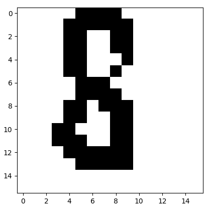

This repo contains applications and demos for embedded FPGA systems developed using the [magma HDL](https://github.com/phanrahan/magma).

Here is a breakdown of the various directories.

(32x32 vs 16x16)
-tf_size (arducam)
-rescale vs rescale32
-I2C regs


## IceStick/HX8K
This directory contains Magma programs written for the Lattice ICE40 IceStick architecture (either the IceStick or the HX8KBoard). They consist of modules (high-level circuits) that perform a specific function and link together to form a contiguous pipeline for capturing, processing, and classifying handwritten digits, and unit tests for some of these modules to test their functionality standalone.

To build and run the tests/examples, first edit the `bake` file to include the name of the program to compile in the `tests` list, then run `./bake` to generate verilog and pcf files. Next, run `./cat_verilog` if necessary (more explanation on this in the aetherling section below), then navigate to the build directory and edit the `Makefile` so that the `NAME` field equals the name of the program to run, then call `make` followed `make upload`.

### arducam.py
A magma module which exposes the SPI interface of an ArduCAM Mini 2MP  peripheral for initiating a capture and receiving image data. 

The module has three phases or states: a capture command phase, a wait phase, and a burst read phase. During the capture command phase, the programs steps through a set of 2-byte commands consisting of a register and value, which are pre-loaded in ROM during initialization, and sends them to the ArduCAM over the MOSI line. When the ArduCAM slave received these commands, it initiates a capture, and the program goes into the wait phase, continually checking the MISO line for the capture completion flag to be set. Once the flag is read as set, the program sends the burst read command to the ArduCAM, then proceeds to contiually read image data from the MISO line.

In order to initialize the ArduCAM for operation, as Raspberry Pi Model A+ is used. The library https://github.com/ArduCAM/RaspberryPi is installed to the Pi (along with the necessary supporting libraries: i2cdev, i2c-tools, WiringPi) and `arducam_ov2640_capture.c` is modified to set the capture format to BMP instead of JPEG (line 76). Now, everytime the ArduCAM is first powered up, the `ov2640_capture` program must be run to properly initialize the I2C registers. A way to setup the ArduCAM so it may be used standalone with the FPGA is to first power the ArduCAM with the FPGA, connect the remaining SPI and I2C headers to the appropriate GPIOs on the Raspberry Pi, and also connect the grounds of the FPGA and Pi together. Then, run `ov2640_capture` to initialize the camera settings and now the I2C connections may be disconnected and the SPI connections wired to the FPGA's GPIOs.

Here are the pin mappings for the ArduCAM / Raspberry Pi interface
```
ArduCAM           Raspberry Pi 
CS                pin 11
MOSI              pin 19
MISO              pin 21
SCK               pin 23
GND               pin 6, 9
VCC               pin 1
SDA               pin 3
SCL               pin 5
```

Currently the I2C registers of the ArduCAM are configured for a 320x240 BMP capture, and thus the image data send over the MISO line consists of 153600 bytes (2 bytes per pixel, 320x240 = 76800 pixels). The resolution of the capture can be adjusted by running `ov2640_capture` with different arguements: for example, `sudo ./ov2640_capture -c test.jpg 320x240` The 2 byte, 16-bit pixels are formatted as RGB565, where the red, green, and blue values are allocated 5, 6, and 5 bits respectively. 

### process.py
A magma module which processes RGB pixel data converting it to grayscale values. It is designed to accept 2 bytes of pixel data at a time from the arducam module output, then interprets it as an 16-bit RGB565 pixel and extracts the red, green, and blue color values and sums them obtain a grayscale value for that pixel. These grayscale values range from 0 to a maximum of 31 + 63 + 31 = 125. 

### rescale.py
This magma module takes grayscale image data output from the process module, and resizes the image to scale it down, while also converting it to binary. It first makes use of the `downscale` aetherling module (more details below), to map over the 320x240 image with a 20x15 sliding window, summing the pixel values in each window to downscale to a 16x16 image. Then a binary threshold is applied so that pixels below a certain value are binarized to 0 and ones above are set to 1. This produces a 16x16 binary version of the original 320x240 RGB image captured by the ArduCAM.

### pipeline.py
BNN digit classifier adapted from https://github.com/MIT-HAN-LAB/BNN_IceStick.
Instead of the loading the image into ROM at initialization time, the circuit
has a RAM for storing image bits so that the input of the BNN may be wired to
another circuit (e.g. the output of the ArduCAM).

The network itself consists only of a single fully connected layer. It flattens the 16x16 image into a size 256 vector and dots it with 10 (number of classes) size 256 weight vectors. The multiply-accumulate operation of the dot product is computed using an XNOR followed by a popcount in order to take advantage of the binary nature of the data. The results of the veector product are succesively compared to each other in order to determine the maximum, which is then chosen as the output of the classifer.

### main.py
The main program which defines a top level module (`main`).  It first uses the `arducam` module to capture a raw image and feeds it the `process` module, which converts it to grayscale. The grayscale version is passed to the `rescale` module, which scales it down to a 16x16 binary image which is then fed to the `pipeline` module and classified as a decimal digit, with the result being shown on the LEDs of the FPGA in binary. All processing up to `pipeline` is done in a streaming fashion, i.e. each pixel coming in from the camera is processed before the next one comes in. Currently, the SPI clock speed for the ArduCAM is set to 3 MHz, which determines the processing rate for the `process` and `rescale` modules. The output of the `rescale` module is collected in a RAM in the `pipeline` module, while the rest of the pipeline set inactive by disabling the clock. When the SPI image transfer is done, and the RAM contains a full image, a flag is set to enable the clock and run the BNN classifier. 

<p align="center">
  
</p>

Pin mappings for the ArduCAM / HX8K board interface
```
ArduCAM           HX8K
CS                J2 pin 4 
MOSI              J2 pin 5
MISO              J2 pin 8
SCK               J2 pin 3
GND               J4 pin 0
VCC               J4 pin 6
```
and for the logic analyzer debugging pins
```
HX8K              Logic Analyzer Channel    Description
J2 pin 9          0                         arducam output
J2 pin 10         1                         process output
J2 pin 11         2                         rescale output
J2 pin 12         3                         transfer done 
```

### uart.py

### wrapinst.py

**TODO:** It would be good to document how to run these tests (using the logic
analyzer?) Also, maybe these should be moved to a `tests` directory. We could
also consider writing some tests for these using the Python or CoreIR
simulator, so we could run them on Travis.
### stencil.py
Test program for the STEN aetherling module (see below).

### downscale_test.py
Test program to downscale a 320x240 ArduCAM image to a 16x16 using the
Downscale aetherling module. Currently too large to run on the IceStick.

### RAM_test.py
Test program which feeds an image stored in ROM to the RAM in the `pipeline.py`
circuit and runs the BNN classifier. Can be used to test the BNN on a custom image. 

## aetherling
This folder contains a "library" of high level magma circuits defined using the [aetherling
library](https://github.com/David-Durst/aetherling). Because these circuits must be 
compiled using the magma coreir backend and coreir mantle target, they cannot be used directly
with the ice40 magma circuits in the IceStick/HX8K folders, and instead must be compiled to 
verilog separately then combined with any programs that use them at the verilog level. For example, 
the `rescale` ice40 module uses the aetherling module `downscale_sub`, so in `rescale.py`, the downscale circuit
is declared and wired up, and the verilog for the program (sat `rescale_test.v`) is generated, but the definition and implementation of the downscale circuit exists in `downscale_sub.py`, so the verilog `downscale_sub.v` must be generated separately by first calling `python downscale_sub.py` to create a json file then runnning `./coreir_compile downscale_sub HX8K` 


(**TODO:** Should this average the pixels? Are they grayscale?)
and the Downscale module (in`downscale.py`) which
is designed to downscale a 320x240 image (taken by the ArduCAM) to a 16x16 (to
feed into the BNN classifier) using a window size of 20x15. 

## util
This folder contains some miscellaneous python scripts. `bmp2png.py` creates a
png image from a csv file of 16-bit RGB pixel values (as bytes),
`bytes2jpeg.py` creates a jpg image from a a csv of raw JPEG bytes,
`gray2img.py` displays a grayscale image from a csv file of grayscale values, and `int2bitarray.py` takes either a 
csv or list of int values representing rows of a binary image .
`monitor.py` is a simple program to receive UART data from the IceStick.
`bmp2png.py`, `gray2img.py`, and `int2bitarray.py` are designed to be used with the logic analyzer to debug/check 
the output of the `arducam`, `process`, and `rescale` modules respectively.  All of these modules include a "UART" output port, which transmits output data from the module at twice the SPI clock (SCLK) speed. These UART ports can be wired to GPIOs on the FPGA, which in turn may be connected to a logic analyzer. In the Saleae Logic software, there is an option to add an analyzer to a channel, 

<p align="left">
  
  
  
</p>

```
[1920, 4032, 3264, 3264, 3136, 3200, 1792, 1920, 3520, 3264, 6336, 7360, 4032, 1984, 0, 0]

[[0 0 0 0 0 1 1 1 1 0 0 0 0 0 0 0]
 [0 0 0 0 1 1 1 1 1 1 0 0 0 0 0 0]
 [0 0 0 0 1 1 0 0 1 1 0 0 0 0 0 0]
 [0 0 0 0 1 1 0 0 1 1 0 0 0 0 0 0]
 [0 0 0 0 1 1 0 0 0 1 0 0 0 0 0 0]
 [0 0 0 0 1 1 0 0 1 0 0 0 0 0 0 0]
 [0 0 0 0 0 1 1 1 0 0 0 0 0 0 0 0]
 [0 0 0 0 0 1 1 1 1 0 0 0 0 0 0 0]
 [0 0 0 0 1 1 0 1 1 1 0 0 0 0 0 0]
 [0 0 0 0 1 1 0 0 1 1 0 0 0 0 0 0]
 [0 0 0 1 1 0 0 0 1 1 0 0 0 0 0 0]
 [0 0 0 1 1 1 0 0 1 1 0 0 0 0 0 0]
 [0 0 0 0 1 1 1 1 1 1 0 0 0 0 0 0]
 [0 0 0 0 0 1 1 1 1 1 0 0 0 0 0 0]
 [0 0 0 0 0 0 0 0 0 0 0 0 0 0 0 0]
 [0 0 0 0 0 0 0 0 0 0 0 0 0 0 0 0]]
```
